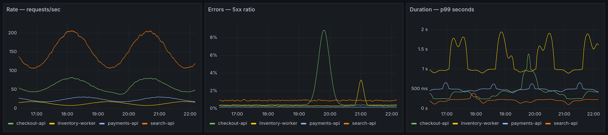
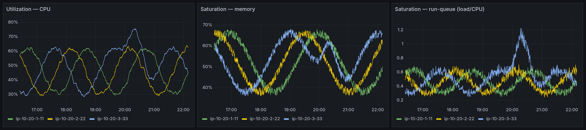

# Observability

How telemetry moves through this architecture, and why the pipeline is shaped the way it is.

The module is [`modules/observability`](modules/observability/); the decision record is
[ADR-0009](docs/adr/0009-otel-collector-and-optional-kafka-bus.md). Every claim below is drawn from
the module source — the file that backs each section is named so it can be checked.

## The argument

Observability built on cloud-vendor-native telemetry does not survive a cloud migration. The
OpenTelemetry Collector is the portability layer: instrumentation (OTLP) and pipelines (receivers +
processors) stay identical across clouds, and only the export seam changes.

This is visible in the module's provider requirements. `modules/observability/versions.tf` declares
exactly one provider — `hashicorp/kubernetes ~> 2.30` — and no vendor SDK. Nothing in the telemetry
path is bound to a monitoring vendor's API. (The incumbent `modules/datadog-monitors` is where the
`DataDog/datadog` provider lives; the two run side by side mid-migration on purpose, and the
retirement criteria are in
[ADR-0009](docs/adr/0009-otel-collector-and-optional-kafka-bus.md#coexistence-with-the-incumbent-monitoring-amendment).)

![Observability architecture: applications outside a labelled application boundary emit OTLP to a gateway collector; the gateway runs one receiver and one processor chain and fans metrics, traces and logs through a variable-driven exporter seam whose trace slot holds Tempo by default with Jaeger and a vendor endpoint as alternatives; an optional Kafka bus, off by default, is drawn as a dashed secondary route that rejoins the same seam; backends on the right are assumed present and installed elsewhere; below, configuration as code ships recording rules, burn-rate alerts, alert routing, dashboards and datasources, and an exemplar pivots from a latency panel into the selected trace backend](docs/images/observability-architecture.svg)

*Where this module's scope begins and ends: applications own their instrumentation and emit OTLP
across the boundary on the left, the gateway fans three signals through a variable-driven exporter
seam whose trace slot is swappable, the Kafka route is optional and off by default, and the
backends on the right are assumed present rather than installed here.*

## The three signal pipelines

Source: `modules/observability/collector.tf` (receivers, processors, pipeline wiring) and
`modules/observability/variables.tf` (the exporter definitions).

The gateway collector is the tier applications send OTLP to. All three signals share one receiver
and one processor chain; they differ only in where they land.

| Signal | Receiver | Processors (in order) | Default exporter |
| --- | --- | --- | --- |
| Metrics | `otlp` | `memory_limiter` → `resource` → `batch` | `prometheusremotewrite` |
| Traces | `otlp` | `memory_limiter` → `resource` → `batch` | `otlp/tempo` (or `otlp/jaeger`) |
| Logs | `otlp` | `memory_limiter` → `resource` → `batch` | `otlphttp/loki` |

The `otlp` receiver listens on gRPC `0.0.0.0:4317` and HTTP `0.0.0.0:4318`. What each processor is
for:

- **`memory_limiter`** — `check_interval = 1s`, soft limit 80% of the container's memory, spike
  limit 25%. Sheds load before the collector OOMs, so a telemetry surge degrades the pipeline
  instead of killing it.
- **`resource`** — upserts `service.namespace` (`var.service_namespace`) and
  `deployment.environment` (`var.environment`) onto every record. Consistent labelling is what lets
  one templated dashboard serve every service rather than one dashboard per service.
- **`batch`** — `timeout = 10s`, `send_batch_size = 8192`. Amortises export overhead.

The exporters are **not hardcoded**. `collector.tf` consumes `var.exporters`, whose defaults keep
everything in-cluster and push-based; the pipeline lists (`var.metrics_pipeline_exporters` and its
peers) select which of them each signal fans out to. Retargeting a backend — including moving cloud
— means editing those variables. Receivers, processors, and the Kafka wiring are untouched.

## The export seam

`var.kafka.enabled` selects between two modes with one control surface, not two mechanisms:

- **direct** (the default, `kafka.enabled = false`) — the gateway exports straight to the backends
  above, with an on-disk sending queue so a backend blip parks telemetry rather than dropping it.
- **bus** (`kafka.enabled = true`) — the gateway exports to Kafka, one topic per signal, and
  separate consumer collectors read those topics and export to the *same* backend definitions.

The backend definitions do not change between modes; only the hop does. The module wires collectors
to an **existing** Kafka — it provisions no broker. `output "transport_mode"` reports which path is
active.

### Choosing a trace backend

The seam is easiest to see on traces, because both supported stores speak the same protocol:

| Trace backend | Exporter | Select it with |
| --- | --- | --- |
| Tempo (reference default) | `otlp/tempo` | `traces_pipeline_exporters = ["otlp/tempo"]` |
| Jaeger | `otlp/jaeger` | `traces_pipeline_exporters = ["otlp/jaeger"]` |

Both ship in the `var.exporters` default map, so moving traces from Tempo to Jaeger is **one
variable**: the `otlp` receiver, the processor chain, the persistent queue, the Kafka wiring, and —
most importantly — the applications are byte-for-byte identical either way. Instrumentation never
learns which trace store it is talking to. That is the whole point of the seam, and
`tests/defaults.tftest.hcl` asserts it.

Jaeger is reached over **OTLP**, which it ingests natively on port 4317. The collector's old
`jaeger` exporter was removed upstream and is deliberately not used here. An exporter that no
pipeline references is inert — the collector starts cleanly with it declared — so shipping both
costs a Tempo shop nothing. Point either at your own endpoint by overriding `var.exporters`.

## Durability: why the direct path is enough

Source: `modules/observability/collector.tf`.

Kafka is off by default because the direct path is already durable:

- A `file_storage` extension is configured at `/var/lib/otelcol/storage`, and every backend exporter
  is wrapped with `sending_queue = { enabled = true, storage = "file_storage" }` plus
  `retry_on_failure` (5s initial interval, 300s max elapsed). The queue is on disk, not in memory,
  so a collector restart does not lose what it had accepted.
- The gateway is a **StatefulSet**, not a Deployment, precisely so that each replica owns its queue.
  A `volume_claim_template` named `storage` gives every replica its own `ReadWriteOnce` 2Gi
  PersistentVolume. A shared volume would not work here: two collectors writing one queue directory
  would corrupt it.

One qualification worth stating precisely, because it is easy to over-claim: **the per-replica
PersistentVolume is the gateway's alone.** The Kafka consumer collectors
(`modules/observability/kafka-consumers.tf`) mount an `emptyDir` for the same path — in bus mode
Kafka itself is the durable buffer upstream of them, so a PVC there would be redundant.

## Recording rules

Source: `modules/observability/prometheus.tf`. Delivered as ConfigMaps — configuration as code, not
click-ops. Group `red-services`:

| Recorded series | Meaning |
| --- | --- |
| `service:request_rate:rate5m` | Rate — requests/sec |
| `service:error_rate:rate5m` | Errors — absolute 5xx rate |
| `service:latency_p99:5m` | Duration — p99 seconds |
| `service:error_ratio:rate5m` | 5xx ÷ total, 5m window |
| `service:error_ratio:rate30m` | 5xx ÷ total, 30m window |
| `service:error_ratio:rate1h` | 5xx ÷ total, 1h window |
| `service:error_ratio:rate6h` | 5xx ÷ total, 6h window |

All are aggregated `by (service_name, service_namespace)`. The four `error_ratio` windows exist for
one reason: they are exactly the windows the burn-rate alerts pair up. A second group, `use-nodes`,
records `node:cpu_utilization:rate5m`, `node:memory_saturation:ratio`, and
`node:load_saturation:ratio` for the USE dashboard.

These expressions assume the OpenTelemetry HTTP semantic conventions
(`http_server_request_duration_seconds_*`); services on other conventions need the expressions
adjusted.

## SLO burn-rate alerting

Source: `modules/observability/slo.tf`.

A static "error ratio > X" either pages on every brief spike (short window) or notices a real outage
far too late (long window). A multi-window, multi-burn-rate pair fixes both. Each alert requires a
**short and a long window to both exceed** the burn rate: the long window proves the burn is
sustained, the short window proves it is still happening now, so the alert clears quickly once
fixed.

| Alert | Windows (both must breach) | Burn rate | `for` | Severity |
| --- | --- | --- | --- | --- |
| `SLOErrorBudgetFastBurn` | `rate5m` **and** `rate1h` | 14.4× | 2m | critical → pages |
| `SLOErrorBudgetSlowBurn` | `rate30m` **and** `rate6h` | 6× | 15m | warning → ticket |

The four windows are two pairs, not a flat set — 5m pairs with 1h, and 30m pairs with 6h. Pairing
them the other way would defeat the design.

Thresholds scale with the SLO rather than being hardcoded: `budget = 1 - var.slo_target`, and the
alert fires above `14.4 × budget` (fast) or `6 × budget` (slow). At the default `slo_target = 0.999`
the fast pair trips at a 1.44% error ratio — burning roughly 2% of the monthly budget in an hour. A
tighter SLO has a smaller budget, so the same burn rate becomes a smaller absolute error ratio,
automatically.

Routing is by severity: `modules/observability/alerting.tf` maps the `severity` label onto PagerDuty
event severity, so a fast burn pages and a slow burn opens a lower-urgency incident. The routing key
is a variable, empty by default, stored in a Kubernetes Secret — never committed.

*The rules above, actually firing. The rule YAML was rendered from `slo.tf` by the module itself —
not retyped — and loaded into a local Prometheus alongside the recording rules from `prometheus.tf`.
Six hours of synthetic `http_server_request_duration_seconds_count` series at a steady 8% error
ratio give the 5m, 30m, 1h and 6h windows real history, which is why both pairs breach: 8% is well
over the 1.44% fast threshold and the 0.60% slow one. The thresholds in frame — `0.0144` and
`0.006` — are what `slo.tf` computes from the default `slo_target = 0.999`, not values typed for the
screenshot.*

*What this is not: a deployed cluster. There is no EKS, no collector and no real traffic here — only
the module's own rule output evaluated against a synthetic feed, which is enough to prove the rules
load, evaluate and fire, and nothing more than that.*

## Kafka bus monitoring

Source: `modules/observability/slo.tf`. These rules exist **only when `var.kafka.enabled`** — the
ConfigMap is conditional. A telemetry bus you cannot see is worse than no bus.

| Alert | Detects | Severity |
| --- | --- | --- |
| `KafkaConsumerLagHigh` | Consumer group lag above `var.kafka.max_lag_alert` (default 50,000 records) for 10m | warning |
| `KafkaConsumerLagGrowing` | Lag `deriv()` positive over 15m — consumers cannot keep up, so loss is coming if retention is exceeded | critical |
| `KafkaPartitionUnderReplicated` | ISR shrunk below replica count for 5m — a broker loss now risks data loss | critical |
| `KafkaPartitionSkew` | Per-partition lag spread beyond half the lag threshold — a hot partition, meaning a bad partition key or unbalanced assignment | warning |

The metrics behind these come from a `kafkametrics` receiver on the consumer collectors, scraping
`brokers`, `topics`, and `consumers` every 30s.

## Dashboards

Source: `modules/observability/grafana.tf` and `modules/observability/dashboards/`.

Two dashboards ship as committed JSON, provisioned through ConfigMaps labelled `grafana_dashboard=1`
for the kube-prometheus-stack Grafana sidecar. Both are templated so one dashboard serves every
service or node:

- **RED — Services** (`dashboards/red-services.json`, uid `red-services`) — variables `$namespace`
  and `$service`; panels *Rate — requests/sec*, *Errors — 5xx ratio*, *Duration — p99 seconds*, each
  reading the recording rules above, plus *Duration — p99 with exemplars (raw histogram)* for the
  trace pivot below.
- **USE — Nodes** (`dashboards/use-nodes.json`, uid `use-nodes`) — variable `$node`; panels
  *Utilization — CPU*, *Saturation — memory*, *Saturation — run-queue (load/CPU)*.

### Templating

Neither dashboard hardcodes a service or node. `$namespace` and `$service` on RED are `query`
variables resolved with `label_values()` against the recording rules — `$service` is chained off
`$namespace` and is multi-select — and every panel query filters on them
(`{service_namespace="$namespace", service_name=~"$service"}`). USE does the same with `$node`.
That is the point: one RED dashboard for every service, not one per service.

There is deliberately **no `$environment` variable.** The recording rules aggregate
`sum by (service_name, service_namespace)`, so the recorded series carry exactly those two labels
and an `$environment` dropdown would come back empty. Environment is a *deployment* dimension
here — one module instance per environment, stamped by the `resource` processor as
`deployment.environment` — not a label on the recorded series. Adding it as a working variable
means changing the `by` clauses in `prometheus.tf`, which also changes what the burn-rate alerts
group by. It is not a dashboard-only change, so it is not made here.

### Exemplars: the metric→trace pivot

Source: `modules/observability/datasources.tf`.

An exemplar is a trace id stapled to a histogram sample. It is what turns "p99 is 2.3s" into
"here is the actual request that took 2.3s". The chain, end to end:

1. The application's OTLP histogram carries exemplars (the SDK samples them from spans in context).
2. The collector's `prometheusremotewrite` exporter translates them to remote-write exemplars and
   attaches the trace id under the label `trace_id`. This needs **no configuration** — the
   translator does it whenever exemplars are present, so there is no flag for it in `var.exporters`.
3. Prometheus stores them — this requires `--enable-feature=exemplar-storage` on the Prometheus
   server, which this module does not own (it configures an assumed-existing Prometheus).
4. Grafana renders them on the panel and links each one to a trace datasource.

Step 4 is why `datasources.tf` exists. Dashboards referenced datasources by name and nothing in
this repo provisioned any, so an exemplar link had nowhere to land. The name is not hardcoded in
the committed JSON: both dashboards are rendered with `templatefile` from
`grafana_datasources.prometheus_name`, so renaming the datasource out of a collision repoints the
panels instead of orphaning them. Datasources now ship as code
through the same Grafana sidecar the dashboards use (`grafana_datasource=1`), and the Prometheus
datasource declares `exemplarTraceIdDestinations` keyed on `trace_id`.

**The trace datasource follows the export seam.** Whichever backend `var.traces_pipeline_exporters`
selects is the one provisioned and the one exemplars pivot into — Tempo by default, Jaeger when you
set `["otlp/jaeger"]`. Point traces at a vendor OTLP endpoint instead and no trace datasource is
provisioned and no exemplar destination is declared, rather than shipping a link to a UID that does
not resolve. The module tests assert all three cases.

**Why a fourth panel instead of a flag on the third.** Exemplars live on the raw histogram buckets
and do not survive rule evaluation, so `service:latency_p99:5m` — a recording-rule output — can
never carry them, and setting `"exemplar": true` on that panel would do nothing. The new panel runs
`histogram_quantile` over `http_server_request_duration_seconds_bucket` directly, which is the more
expensive query and exactly what the recording rule exists to avoid. Both panels stay: the cheap
precomputed one for the SLI you watch, the raw one for the pivot you take when it moves. Click a
diamond on it and you land on that request's trace.

Note the datasource URLs are **query** endpoints, not the OTLP ingest endpoints in `var.exporters`:
Tempo answers queries on 3200 and Jaeger on 16686 while both ingest on 4317. If your Grafana
umbrella chart already provisions a datasource named `Prometheus`, set
`grafana_datasources.enabled = false` or rename via `prometheus_name`/`prometheus_uid` so the two
do not fight.

### Rendered dashboards

Both images below are real Grafana renders of the **committed dashboard JSON in this repo** — the
same files `grafana.tf` provisions — driven by synthetic telemetry. Nothing in them is mocked up:
Prometheus evaluated the recording rules from `prometheus.tf` over generated
`http_server_request_duration_seconds_*` and node-exporter series, and the panels drew whatever
those rules produced. The RED render shows the three recording-rule panels; it was captured before
the exemplar panel was added and does not include it, because the synthetic feed emits metrics and
no traces — that panel would draw a bare duplicate of the p99 line with no exemplars on it, which
is worse than not showing it.

*`RED — Services`, rendered from the three recording-rule panels of `dashboards/red-services.json`
against synthetic data. The `checkout-api` incident is one event seen twice: the 5xx ratio climbs
to ~8.8% while p99 latency rises with it, which is exactly the correlation the burn-rate alerts key
on. Series are the recording rules — `service:request_rate:rate5m`, `service:error_ratio:rate5m`,
`service:latency_p99:5m` — not raw queries.*

*`USE — Nodes`, rendered from `dashboards/use-nodes.json` against synthetic data. Node
`ip-10-20-3-33` shows a saturation event where run-queue ratio crosses 1.0 — more runnable threads
than cores — while CPU utilization peaks near 76%. Series are `node:cpu_utilization:rate5m`,
`node:memory_saturation:ratio`, and `node:load_saturation:ratio`.*

The render harness is deliberately **not committed**: the module provisions configuration into an
assumed-existing Prometheus/Grafana and installs neither, so a compose file living in this repo
would imply a runtime that the module does not own. Reproducing the images takes a Grafana with a
Prometheus datasource, the recording rules from `prometheus.tf` loaded, and a workload emitting the
OTel HTTP semconv metrics for longer than the 5m rate windows.

There is deliberately **no error-budget-burn panel**. Burn rate exists in this module as alerting
rules (`slo.tf`), not as a dashboard; the closest committed panel is *Errors — 5xx ratio*, which
plots the SLI those alerts are built from.

## What this does not do

- Does not install Prometheus, Grafana, Alertmanager, Tempo, or Loki.
- Does not deploy Kafka — bus mode wires to an existing broker.
- Does not instrument applications. Emitting OTLP is the app's job; this is the pipeline that
  receives it.
