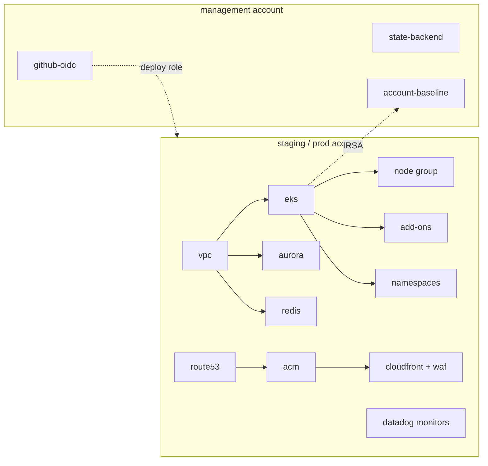

# Terragrunt + OpenTofu Reference Architecture

[](https://github.com/bezilla/terragrunt-reference-architecture/actions/workflows/validate.yml)
[](LICENSE)


A production-shaped AWS platform — EKS, Aurora, a CloudFront/WAF edge, Datadog monitoring, and
keyless CI — built as reusable OpenTofu modules and Terragrunt stacks, isolated across
management/staging/prod accounts. It is meant to be read as much as run: the non-obvious choices
are written down as ADRs, and everything is sanitized to placeholder values so you can clone it,
fill in a handful of inputs, and `plan` it. Aimed at platform engineers evaluating a Terragrunt
layout, and at anyone who wants a worked example rather than a tutorial.

## Architecture



Traffic resolves via Route53 → CloudFront (WAFv2, ACM cert in us-east-1) → EKS workloads. Pods
reach Aurora and Redis privately inside the VPC. State lives per-account in S3 with native locking.
Full write-up: [docs/architecture.md](docs/architecture.md).

### What each stack provisions

| Stack | Provisions | Rough monthly cost¹ |
|---|---|---|
| **management** | State bucket + KMS, GitHub OIDC provider, IAM users/groups/IRSA baseline | ~$5 |
| **staging** | VPC (1 NAT), EKS + spot nodes, Aurora (1× t4g.medium), Redis (t4g.small), Route53, Datadog monitors | ~$300 |
| **prod** | VPC (NAT/AZ), EKS + on-demand nodes, Aurora (2× r6g.large), Redis (r7g.large), CloudFront+WAF, ACM, Route53, monitors | ~$1,500 |

¹ Approximate, us-west-2 on-demand list prices, excluding data transfer and request charges. These
are hand estimates; the `plan` workflow posts a precise [Infracost](https://www.infracost.io) diff
on every PR once `INFRACOST_API_KEY` is set.

## Quickstart

Prerequisites: [`mise`](https://mise.jdx.dev) (installs the pinned OpenTofu/Terragrunt/tflint/etc.),
`git`, and AWS credentials for the account you're deploying into.

```bash
git clone https://github.com/bezilla/terragrunt-reference-architecture
cd terragrunt-reference-architecture
mise install                                    # pinned toolchain

# 1. Fill in the values you own (see "Required inputs"):
for a in management staging prod; do
  cp live/$a/account.hcl.example live/$a/account.hcl
done
$EDITOR live/*/account.hcl                       # set account_id, deploy_role_arn

# 2. Validate everything offline — no AWS credentials needed:
make validate

# 3. Bootstrap remote state in the management account (one time).
#    The state-backend unit creates the S3 bucket + KMS key using LOCAL state — it cannot store its
#    own state in a bucket that does not exist yet. Every OTHER unit then uses that bucket. The
#    state-backend unit keeps local state by design (it is tiny and rarely changes; back it up).
aws sso login                                    # or however you get credentials
cd live/management/us-west-2/global
terragrunt stack generate
terragrunt run --all apply                        # creates the S3 state bucket + KMS key
cd -

# 4. Deploy a stack (management is already applied above):
cd live/staging/us-west-2/staging
terragrunt stack generate
terragrunt run --all plan                          # review
terragrunt run --all apply
#    Then repeat for prod. Order: management → staging → prod.
```

CI does steps 3–4 for you via the `apply` workflow once you wire up OIDC (see [CI/CD](#cicd)).

## Required inputs

Everything else has a safe default. These do not:

| Input | Where | How to know it's right |
|---|---|---|
| `account_id` | `live/<account>/account.hcl` | 12-digit AWS account ID per environment; `aws sts get-caller-identity` |
| `deploy_role_arn` | `live/<account>/account.hcl` | ARN of the role Terragrunt assumes; leave empty to use ambient creds |
| GitHub org / repo | `catalog/units/iam-github-oidc` | your `owner/repo`, for the OIDC deploy-role trust `sub` claim |
| DNS zone | stack `values` (`route53-zone`, `acm-certificate`) | a domain you control in the account (Route53 must be authoritative) |
| Datadog keys | `DD_API_KEY` / `DD_APP_KEY` env vars | from Datadog; never committed — read by the datadog-monitors unit |
| `AWS_PLAN_ROLE_ARN` / `AWS_APPLY_ROLE_ARN` | repo Actions **variables** | ARNs from the `iam-github-oidc` module output; enables the CI pipeline |

## Repository layout

| Path | What's in it |
|---|---|
| `modules/` | 15 reusable OpenTofu modules (each with tests, a README, and a lockfile) |
| `catalog/units/` | Terragrunt unit definitions that source the modules |
| `live/` | `root.hcl` + per-account `account.hcl`/`region.hcl`/`env.hcl` + environment stacks |
| `policy/` | OPA/conftest policies (tags, ingress, encryption, IMDSv2) + tests |
| `docs/` | architecture, ADRs, and how-to guides |
| `.github/workflows/` | validate (PR), plan (PR), apply (merge), drift (weekly) |

## Design decisions

Each links to its ADR:

- [OpenTofu default, Terraform drop-in](docs/adr/0001-opentofu-over-terraform.md) — avoid the BSL, stay compatible.
- [Multi-account isolation](docs/adr/0002-multi-account-vs-single-account.md) — account boundaries over VPC-only separation.
- [Terragrunt Stacks](docs/adr/0003-terragrunt-stacks-over-flat-units.md) — one stack file per environment, not copied unit trees.
- [Modules in-repo](docs/adr/0004-modules-in-repo-vs-separate-repo.md) — one clone, referenced by repo root.
- [S3 native locking](docs/adr/0005-s3-native-locking-over-dynamodb.md) — no DynamoDB lock table.
- [Managed node groups](docs/adr/0006-eks-managed-node-groups.md) — one worker strategy, not three.
- [Tagging via default_tags](docs/adr/0007-tagging-and-default-tags.md) — baseline tags once, in the provider.
- [Deploy pipeline](docs/adr/0008-deploy-pipeline-apply-on-merge.md) — apply on merge, gated by a prod environment reviewer.
- [Observability & the OTel collector](docs/adr/0009-otel-collector-and-optional-kafka-bus.md) — the collector as the cloud-portability seam; Kafka only above a stated bar.

### What this deliberately does not do

Scope is a choice; these omissions are intentional, not unfinished:

- **No multi-region.** One region per account. Aurora Global Database is available behind a flag,
  but active-active multi-region is a large operational commitment this reference doesn't pretend to.
- **No service mesh.** Namespace RBAC and security groups, not Istio/Linkerd. A mesh earns its
  complexity at a scale a reference repo can't honestly demonstrate.
- **One Kubernetes compute model.** Managed node groups only — no self-managed ASGs, no Karpenter,
  no Fargate mix. When each of those is worth it is in [ADR-0006](docs/adr/0006-eks-managed-node-groups.md).
- **One CDN and one monitoring vendor.** CloudFront and Datadog, not a multi-vendor edge or an
  abstraction over observability backends.

## Day 2

- [Adding an environment](docs/adding-an-environment.md)
- [Adding a module](docs/adding-a-module.md)

### Tearing it down

Destroy in reverse dependency order, and never destroy `management` before the workload accounts
(it holds their state):

```bash
for stack in prod/us-west-2/prod staging/us-west-2/staging; do
  cd live/$stack && terragrunt run --all destroy && cd -
done
# Aurora has deletion_protection and skip_final_snapshot=false: disable protection and take/accept
# the final snapshot first, or the destroy will refuse. Then, last:
cd live/management/us-west-2/global && terragrunt run --all destroy
# The state bucket has versioning + a KMS key; empty and delete it by hand if you want it gone.
```

## CI/CD

Four workflows, all of which skip cleanly (with a message) when their AWS role variables are unset:

- **validate** (PR) — `tofu fmt`, `terragrunt hcl fmt`, tflint, trivy, terraform-docs drift,
  gitleaks, offline `run --all validate`, and `make test` (module + policy tests).
- **plan** (PR) — detects changed stacks, assumes `AWS_PLAN_ROLE_ARN` via OIDC, plans each, checks
  the plan against the conftest policies, and comments the plan + Infracost diff.
- **apply** (merge to `main`) — applies management → staging → prod, each behind a GitHub
  Environment. **You must create these Environments** and put required reviewers on `prod`.
- **drift** (weekly) — plans every stack and opens an issue if one has drifted.

To adopt: run the `iam-github-oidc` module, set the two role ARNs as repository **Variables**, and
create the three Environments. The exact IAM trust policy is documented at the top of
[`plan.yml`](.github/workflows/plan.yml). No long-lived AWS keys are used anywhere.

## Related

- [capsize](https://github.com/bezilla/capsize) — a read-only Kubernetes CLI that scores cost waste and blast radius together, for the kind of EKS clusters this architecture provisions.

## License

[Apache 2.0](LICENSE).
