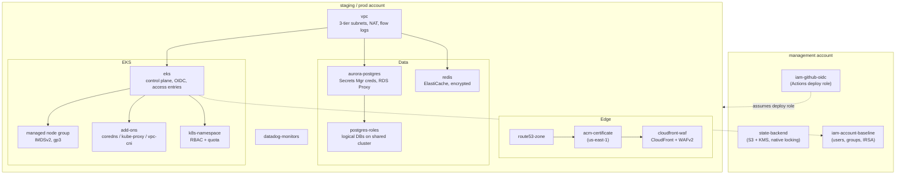

# Architecture

A single-region-per-account AWS platform: a VPC, an EKS cluster with managed nodes, Aurora
PostgreSQL and Redis for data, a CloudFront + WAF edge, Datadog monitors, and IAM wired for
keyless CI and workload identity. Environments are isolated by account.

## Request path
Public traffic resolves through **Route53** to a **CloudFront** distribution, filtered by a
**WAFv2** web ACL (managed rule groups + per-IP rate limit), terminating TLS with an **ACM**
certificate issued in us-east-1. Origins are the workloads running in **EKS**, fronted by
in-cluster ingress. East-west data access stays inside the **VPC**: pods reach **Aurora** and
**Redis** through security groups, never over the public internet, with S3/DynamoDB traffic kept on
gateway endpoints.

## State & identity
Each account keeps its own state in an **S3 bucket with native locking** (no DynamoDB), encrypted
with a per-bucket KMS key. Deploys run from **GitHub Actions via OIDC** — a short-lived role, no
static keys. Inside the cluster, workloads use **IRSA** to assume scoped roles rather than sharing
node credentials.

## Environments
`staging` and `prod` are the same catalog units instantiated with different `values` (sizing, NAT
strategy, deletion protection). `management` holds the state backend, the CI OIDC provider, and the
IAM baseline. See [adding-an-environment](adding-an-environment.md).
